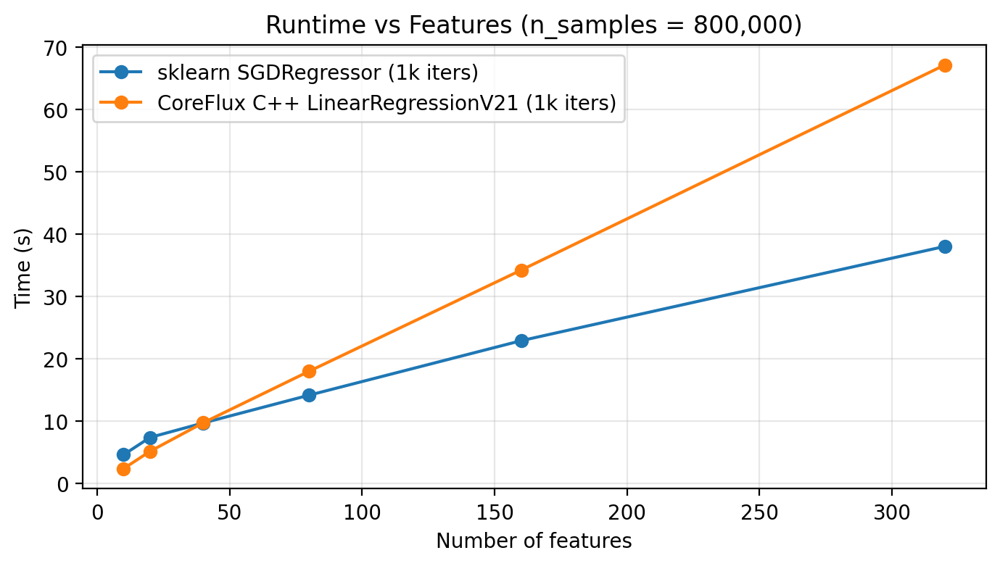

# Linear Regression (CoreFlux)

CoreFlux includes several implementations of linear regression, each building on the same mathematical foundation but optimized for different goals:

- A **Rust implementation**, used as the correctness-first baseline.
- A **C++ CPU implementation (v21)**, optimized with OpenMP and cache-friendly loops.
- A **future C++ CPU v22** version focused on memory-bandwidth optimizations.
- (Later) a **CUDA GPU version** for extreme-scale workloads.

This document walks through the math behind linear regression, the gradient descent algorithm, and how the different CoreFlux implementations perform, especially at large dataset sizes.

## 1. Problem Setup

We are given:

- $\vec{X}$ matrix consisting of $samples*features$
- $\vec{y}$ matrix constisting of $samples*1$

---

## 2. Loss Function: Mean Squared Error (MSE)

We measure how well the model fits the data using **mean squared error**:

$mse = \frac{1}{2n} \sum_{i=1}^n (\hat{y} - y)^2$

We want to find optimal parameters such that the loss function becomes as small as possible:

$\hat{y}$ is defined as $\hat{y} = \vec{a} * \vec{w} + b$

$\vec{a}$ is input for features.
$\vec{w}$ is weights we choose to make the best model and together with $b$ the bias is the variables we want to find the best values for.

There is a closed-form solution, but CoreFlux intentionally uses **gradient descent** for consistency with later GPU-based models.

---

## 3. Gradient Descent

To find the best possible values for our parameters, we use gradient descent. Imagine the cost function as a steadily increasing curve on a 2D plane. If you wanted to minimize it, you would simply walk downhill along that curve. In practice, this means taking a step in the opposite direction of the tangent at your current point, or in higher dimensions, in the opposite direction of the gradient.

If this feels a bit abstract, try sketching it: draw any curve (it doesn’t need to be linear), pick a point on it, and draw the tangent line at that point. If you repeatedly move a small step in the opposite direction of the tangent, you’ll find yourself at a lower point each time.

Although this is slightly outside the scope of our project, it’s worth noting that one of the major challenges in machine learning is finding not just a local minimum but a global one. Gradient descent can only guarantee convergence to a local minimum; the true global minimum might be far lower and much harder to reach.

### 3.1 Gradients

We start with:
$mse = \frac{1}{2n} \sum_{i=1}^n (\hat{y}_i - y_i)^2$

We now want to derive the cost function in regard to $w_j$

Let $e_i = \hat{y_i} - y_i$

$\frac{\partial mse}{\partial w_j} =  \frac{\partial}{\partial w_j} \frac{1}{2n} \sum_{i=1}^n e_i^2 = \frac{1}{2n} \sum_{i=1}^n 2e_i \frac{\partial e_i}{\partial w_j} = \frac{1}{n} \sum_{i=1}^n e_i \frac{\partial e_i}{\partial w_j}$

$$\frac{\partial e_i}{\partial w_j}
= \frac{\partial}{\partial w_j}(\hat{y}_i - y_i)
= \frac{\partial}{\partial w_j}(\vec{a_i} \cdot \vec{w} - y_i)
= \frac{\partial}{\partial w_j}(a_{i1}w_1 + \dots + a_{ij}w_j + \dots + a_{in}w_n - y_i)
$$

this simplifies simply to:

$\frac{\partial e_i}{\partial w_j} = a_{ij}$ for each $i$

The final formula for each gradient ($\frac{\partial mse}{\partial w_j}$) $g_j = \frac{1}{n} \sum_{i=1}^n e_i a_{ij}$

Now we need to compute this gradient for each weight. These calculations are independent, because each gradient component only depends on the errors and its corresponding feature value $a_{ij}$.

CoreFlux performs these computations in parallel, which allows it to outperform scikit-learn on large datasets.

---

## 4. Algorithm Outline

With the gradient formulas in place, the full training loop becomes straightforward. For each iteration:

Predict
$\hat{y} = X w + b$

Compute the error
$e = \hat{y} - y$

Compute gradients
$\text{grad}_w = \frac{1}{n} X^\top e$
$\text{grad}_b = \frac{1}{n} \sum_i e_i$

Update the parameters
$w \leftarrow w - \alpha , \text{grad}_w$
$b \leftarrow b - \alpha , \text{grad}_b$

This is standard batch gradient descent, where the entire dataset is used for each update.

---

## 5. Rust Implementation Notes

The Rust version of CoreFlux is intentionally simple. It serves as the correctness-first baseline of the project.

- Single-threaded
- Explicit loops (no vectorization or BLAS)
- No SIMD or OpenMP
- NumPy arrays passed as contiguous f64 buffers

This makes it easy to verify correctness before optimizing.

- The optimized C++ version uses:
- fused loops
- cache-efficient memory traversal
- OpenMP parallelism

but the mathematics stays exactly the same.

---

## 6. Feature Scaling

Gradient descent converges faster and more stably if features are scaled.

For example:

```python
norms = np.linalg.norm(X_train, axis=0)
norms[norms == 0] = 1
X_train_scaled = X_train / norms
```

Apply the **same scaling** to test data.

---

## 7. Python Usage

### Initialize the model

```python
import coreflux_rust

lr = coreflux_rust.LinearRegression(
    iterations=1000,
    learning_rate=0.01,
    mode=coreflux.Mode.Regression
)
```

### Fit and predict

```python
lr.fit(X_train_scaled, y_train)
pred = lr.predict(X_test_scaled)
```

### Full Example

```python
import numpy as np
import coreflux_rust

# Synthetic dataset
X_train = np.array([
    [1.0, 1.0],
    [2.0, 3.0],
    [4.0, 2.0],
    [5.0, 5.0],
], dtype=np.float64)

y_train = np.array([6.0, 14.0, 15.0, 26.0], dtype=np.float64)

# Scale features
norms = np.linalg.norm(X_train, axis=0)
norms[norms == 0.0] = 1.0
X_train_scaled = X_train / norms

# Prediction input
X_pred = np.array([[3.0, 4.0]], dtype=np.float64)
X_pred_scaled = X_pred / norms

# Train and predict
lr = coreflux_rust.LinearRegression(iterations=1000, learning_rate=0.01, mode=coreflux_rust.Mode.Regression)
lr.fit(X_train_scaled, y_train)
pred = lr.predict(X_pred_scaled)

print(pred)
```

---

## 8. Relation to C++ Implementation

The C++ backend (`coreflux_cpp.LinearRegression`):

- uses OpenMP
- fuses inner loops
- optimizes cache locality

and therefore:

- outperforms the Rust version
- surpasses scikit-learn’s `SGDRegressor` on large datasets

---

## 9. Benchmarking & Scaling Results

When I first compared my C++ model with scikit-learn, I expected the performance gap to just grow and grow as the dataset got bigger. But that’s not what happened at all.

Up to around 200k samples, the C++ version is clearly faster — sometimes almost 2×.
After that, the two lines basically start hugging each other on the scaling plot.

My best guess:
we’re simply slamming into memory bandwidth.

At some point (feels like ~300k rows), the CPU can’t pull data from RAM any faster, so both implementations end up limited by the exact same thing — memory throughput. Once you hit that wall, everything starts scaling linearly and the speedup shrinks. Exactly what we saw in the mid-range.

To test this theory, I pushed the dataset sizes even further.

And interestingly, at very large sizes (1.6M, 3.2M, 6.4M samples), the C++ implementation actually starts pulling ahead again. Nothing crazy, but definitely measurable.

The most likely reason:
on massive datasets, all the “small overheads” inside sklearn; Python layers, single-threaded inner loops, allocator noise, finally start to matter. Meanwhile my C++ version is basically a tight, predictable OpenMP loop with almost no overhead, so even though both are memory-bound, mine wastes less time on everything around the actual math.

So the full picture looks like this:

- small datasets: C++ wins clearly
- medium datasets: both hit the memory wall → nearly identical scaling
- huge datasets: sklearn’s overhead leaks through → C++ drifts ahead again

---

## Scaling Plot: Medium Dataset Sizes (v21)

Here is the scaling behavior of the first C++ implementation (v21) versus scikit-learn’s `SGDRegressor` on a medium-sized dataset (200k samples, 40 features). This is where v21 performs best, roughly 2× faster than sklearn before both implementations start running into memory bandwidth limits.

<p>
  
</p>

---

## Scaling Plot: Large Dataset Sizes (v21)

At 800k samples, the gap shrinks. Both models are now clearly memory-bound, and the curves start tracking each other closely.

<p>
  
</p>

---

## Scaling Plot: Very Large Dataset Sizes (v21)

At 1.6 million samples (and beyond), something interesting happens: even though both implementations are still hitting the memory wall, the C++ version starts to pull ahead again. My best guess is that sklearn’s Python overhead and lack of multi-threaded updates finally start to show, while the C++ kernel remains a tight OpenMP loop.

<p>
  
</p>

---

## 10. What’s Next?

Before jumping into CUDA, there’s definitely more performance left on the CPU side. When I originally wrote the C++ v21 implementation, my main priorities were:

- keep the inner loops cache-friendly
- keep the parallelization simple and clean

What I didn’t think about was the **total memory traffic** these loops generate. Now that I’ve seen how quickly both implementations hit the memory wall, optimizing memory usage is the next obvious step.

Instead of modifying the existing implementation, the plan is to build a brand-new version (v22) alongside v21, so I can benchmark the two versions directly and measure exactly how much each optimization helps.

---

## 11. Ideas Worth Testing

These are the main optimizations I’ll explore for the v22 CPU kernel:

- **float32 instead of float64**  
  Most ML datasets don’t need 64-bit precision. Switching to float32 cuts memory usage, and memory traffic—in half. If someone needs float64, we can expose a toggle.

- **fused memory passes**  
  Currently, prediction, error computation, and gradient accumulation all scan the dataset separately. Fusing them into a single pass means touching `X` once per iteration instead of 2–3 times.

- **better reduction strategy**  
  The current reduction relies on a critical section. Using OpenMP’s `reduction` clause or a tree-style reduction should remove contention and improve scaling.

- **SIMD vectorization**  
  The inner dot-product loop is perfectly suited for AVX2/AVX-512. Even modest changes to help autovectorization could provide a big win for large feature counts.

- **thread/core tuning**  
  Exploring different OpenMP scheduling strategies, thread pinning, and NUMA awareness could yield small but meaningful improvements at massive dataset sizes.

All of these improvements will go into the **v22 CPU backend**, which will sit next to v21 so I can compare them properly before moving into GPU territory.
